# Merock Real Estate — Production Database Architecture

**Version:** 1.0 · **Target RDBMS:** PostgreSQL 16+ · **Scale target:** 100K+ users, 1M+ properties
**Author:** Database Architecture Team · **Status:** Approved for implementation

---

## 1. Business Domain Analysis

Merock is a **marketplace + CRM + transaction platform**. The current frontend (admin dashboard, agent workspace, client app, member/referral portal) already implies four actor roles: `admin`, `agent`, `client` (buyer/investor), `member` (referrer). The database must serve five business planes:

| Plane | Modules |
|---|---|
| **Identity & Access** | User Management, Authentication, Authorization, Role Management, Sessions, Tokens, Multi-Tenancy |
| **Catalog** | Property Management, Categories, Types, Amenities, Images, Videos, Documents, Locations, Listings, Status, Ownership, Agent Assignment, Price History |
| **CRM / Demand** | Leads, Customers, Buyers, Sellers, Enquiries, Visits, Saved Properties, Saved Searches, Referrals |
| **Transactions** | Bookings, Sales, Rentals/Leases, Rent Schedules, Payments, Invoices, Commissions, Refunds |
| **Platform** | Reviews & Ratings, Notifications, Support Tickets, Blogs, CMS, SEO, Audit Logs, Activity Tracking, Analytics, Media Library |

**Additional modules identified** (required for a modern platform, beyond the supplied list):

1. **Referral / Member Program** — your app already has a `member` role with a referrals page; needs `referrals` + commission tracking.
2. **Saved Searches & Match Alerts** — buyers store criteria (budget, locality, BHK); the platform pushes new matching listings. Core marketplace retention feature.
3. **Commission Management** — agent earnings (your `agents.js` tracks `earnings`, `dealsClosedThisMonth`).
4. **KYC / Verification** — RERA IDs for agents, ownership document verification for sellers, listing moderation queue.
5. **Lease Lifecycle Management** — rent escalation, renewal, security deposits, recurring rent invoicing.
6. **Media Library** — central object store registry (S3 keys), deduplication, virus-scan status.
7. **Localization & Currency** — multi-city (Hyderabad today, multi-region tomorrow), money stored as `NUMERIC` + currency code.
8. **Feature Flags / Settings** — runtime configuration without deploys.

### Data flow (happy path)

```
Visitor → registers (users) → browses (property_views, search_logs)
       → enquires (enquiries → leads) → agent assigned (lead_assignments)
       → site visit (property_visits) → negotiation (lead_activities)
       → booking (bookings + payments) → sale/lease (transactions / leases)
       → invoice + commission (invoices, commissions) → review (reviews)
Every mutation → audit_logs; every event → activity_events → analytics rollups
```

---

## 2. Database Architecture Overview

### Architectural decisions

| Decision | Choice | Rationale |
|---|---|---|
| RDBMS | **PostgreSQL 16** | Row-Level Security (multi-tenant), PostGIS (geo search), JSONB (flexible attributes), partitioning, mature replication |
| Primary Keys | **UUID v7** | Time-ordered (index-friendly, unlike v4), safe for public APIs, merge-safe across shards |
| Soft deletes | `deleted_at TIMESTAMPTZ` | Marketplace/legal requirement: never hard-delete transactional or audit data |
| Money | `NUMERIC(14,2)` + `currency CHAR(3)` | Never float; multi-currency ready |
| Time | `TIMESTAMPTZ` everywhere | Multi-region correctness |
| Enumerations | **Lookup tables** for business-managed lists (statuses, types, amenities); `CHECK` constraints for fixed system enums | Admin-editable without migrations vs. integrity for invariants |
| Flexible attributes | `JSONB attributes` on `properties` + GIN index | 1M properties with heterogeneous specs (plot vs. apartment vs. commercial) without 50 nullable columns or EAV |
| Geo | PostGIS `GEOGRAPHY(POINT)` | Radius search ("within 5 km of Gachibowli") |
| Full-text search | `tsvector` generated column → later offload to OpenSearch/Meilisearch | Start in-DB, scale out |
| Multi-tenancy | Shared schema + `tenant_id` + **RLS** | Cheapest to operate at this scale; see §10 |

### Why the core entities exist

- **`users` vs. profile tables (`agent_profiles`, `customer_profiles`)** — one identity, many hats. A user can be simultaneously a buyer and a seller; an agent is a user with a professional profile. Avoids duplicate identity records and broken auth.
- **`properties` vs. `listings`** — a *property* is the physical asset; a *listing* is a commercial offer on it (for-sale, for-rent, possibly both, possibly relisted later). Separating them preserves asset history across multiple market cycles and supports rent + sale simultaneously.
- **`leads` vs. `enquiries`** — an *enquiry* is the raw inbound event (form submission, call); a *lead* is the qualified CRM object with pipeline stage, owner, score. Many enquiries can roll into one lead.
- **`transactions` vs. `payments`** — a transaction (sale/booking/lease) is the business deal; payments are the money movements (token advance, installments, rent) against it. 1:N.
- **`audit_logs` (immutable, partitioned)** — compliance, dispute resolution, debugging. Append-only, never updated.

### Security posture (summary — detail in §8)

RBAC via `roles`/`permissions`, RLS for tenant + ownership isolation, Argon2id password hashes, rotating refresh tokens stored hashed, PII column-level encryption (`pgcrypto`/app-layer KMS), full audit trail, soft deletes.

### Scalability posture (summary — detail in §9, §16)

Time-partitioned hot tables (`property_views`, `audit_logs`, `notifications`), covering indexes for the 10 hottest queries, keyset pagination, read replicas for search/analytics, CDC (Debezium) → warehouse for BI.

---

## 3. Entity Identification

| # | Module | Entity | Purpose | Key Business Rules | Depends On |
|---|---|---|---|---|---|
| 1 | Tenancy | `tenants` | Organization (agency/brokerage) using the platform | Unique slug; suspended tenant blocks all child logins | — |
| 2 | Identity | `users` | Single identity for every human | Email unique per tenant; must verify email before transacting | tenants |
| 3 | AuthZ | `roles` | Named permission bundles (admin, agent, client, member, owner, support) | System roles immutable; tenant roles editable | tenants |
| 4 | AuthZ | `permissions` | Atomic capabilities (`property.create`, `lead.assign`) | Seeded, code-owned | — |
| 5 | AuthZ | `role_permissions` | M:N roles↔permissions | — | roles, permissions |
| 6 | AuthZ | `user_roles` | M:N users↔roles | A user holds ≥1 role; admin removal requires another admin | users, roles |
| 7 | Auth | `user_sessions` | Active login sessions | Max N concurrent; revocable | users |
| 8 | Auth | `refresh_tokens` | Rotating refresh tokens | Single-use; reuse ⇒ revoke family | user_sessions |
| 9 | Auth | `password_reset_tokens` | One-time reset links | 30-min TTL, single use | users |
| 10 | Auth | `login_history` | Every auth attempt | Append-only; lockout after 5 failures/15 min | users |
| 11 | Profiles | `agent_profiles` | Professional agent data (RERA, specialization, rating) | One per user; must be verified to be assigned listings | users |
| 12 | Profiles | `customer_profiles` | Buyer/investor preferences & budget | One per user | users |
| 13 | Profiles | `owner_profiles` | Seller/landlord KYC | Verified before listing goes public | users |
| 14 | Referral | `referrals` | Member-program referral records | One reward per converted referee; self-referral blocked | users |
| 15 | Geo | `locations` | Hierarchical geo tree (country→state→city→locality) | Closure via `parent_id`; slug unique within parent | self |
| 16 | Catalog | `property_categories` | Top split: Residential / Commercial / Land / Industrial | Admin-managed | — |
| 17 | Catalog | `property_types` | Apartment, Villa, Studio, Penthouse, Office, Plot… | Belongs to one category | property_categories |
| 18 | Catalog | `amenities` | Master amenity list (Gym, Pool, Gated…) | Unique name; grouped | — |
| 19 | Catalog | `properties` | The physical asset | Must have owner, type, location to activate | types, locations, users |
| 20 | Catalog | `property_amenities` | M:N property↔amenity | — | properties, amenities |
| 21 | Catalog | `property_images` | Gallery | ≥1 image + exactly 1 primary to publish | properties, media_assets |
| 22 | Catalog | `property_videos` | Walkthroughs / virtual tours | URL or media ref | properties |
| 23 | Catalog | `property_documents` | Title deed, EC, floor plan, NOC | Sensitive: ACL-gated download | properties, media_assets |
| 24 | Catalog | `property_owners` | M:N ownership w/ share % | Shares sum ≤ 100% | properties, users |
| 25 | Catalog | `property_agents` | M:N agent assignment w/ role (primary/co-listing) | Exactly 1 primary | properties, users |
| 26 | Catalog | `property_status_history` | Status audit (draft→pending→active→sold…) | Append-only; valid transitions enforced in app + trigger | properties |
| 27 | Catalog | `property_price_history` | Every price change | Append-only | listings |
| 28 | Listing | `listings` | Commercial offer (sale/rent) on a property | One *active* listing per (property, listing_type); rent listings need deposit terms | properties |
| 29 | CRM | `lead_sources` | Channel master (website, referral, walk-in, portal) | Seeded + admin-extensible | — |
| 30 | CRM | `leads` | Qualified demand object w/ pipeline stage | Stage machine: new→contacted→qualified→visit→negotiation→won/lost | users, sources |
| 31 | CRM | `enquiries` | Raw inbound interest in a listing | Always linked to listing; auto-creates/merges lead | listings, leads |
| 32 | CRM | `lead_activities` | Calls, notes, follow-ups, stage changes | Append-only | leads, users |
| 33 | CRM | `lead_assignments` | Lead routing history | One active assignment | leads, users |
| 34 | CRM | `property_visits` | Scheduled site visits | No double-booking same slot per agent; feedback captured | listings, leads, users |
| 35 | CRM | `saved_properties` | Favorites | Unique (user, property) | users, properties |
| 36 | CRM | `saved_searches` | Stored criteria + alert frequency | JSONB criteria | users |
| 37 | Txn | `bookings` | Token-advance reservation of a listing | Listing → `reserved`; expires if unpaid in T hours | listings, users |
| 38 | Txn | `transactions` | Master deal record (sale or lease execution) | Immutable financials post-completion | listings, bookings, users |
| 39 | Txn | `leases` | Rental agreement & terms | Linked to transaction; generates rent schedule | transactions |
| 40 | Txn | `rent_schedules` | Per-period rent dues | Generated on lease activation | leases |
| 41 | Txn | `payments` | Money movements (gateway/cash/cheque) | Idempotency key unique; states: initiated→success/failed/refunded | transactions, invoices |
| 42 | Txn | `invoices` | Tax documents | Sequential gapless number per tenant per FY | transactions, users |
| 43 | Txn | `invoice_items` | Invoice lines | ≥1 line | invoices |
| 44 | Txn | `commissions` | Agent earnings per deal | % or flat; payable post payment-clearance | transactions, users |
| 45 | Txn | `refunds` | Reversals | ≤ original payment amount | payments |
| 46 | Social | `reviews` | Ratings for properties & agents (polymorphic) | One per (author, subject); verified-transaction badge | users |
| 47 | Notify | `notification_templates` | Versioned message templates per channel | Handlebars-style variables | — |
| 48 | Notify | `notifications` | Per-user notification instances | Partitioned by month | users, templates |
| 49 | Notify | `notification_deliveries` | Per-channel delivery attempts & provider status | Retry w/ backoff | notifications |
| 50 | Notify | `notification_preferences` | Per-user channel/category opt-ins | Transactional cannot be disabled | users |
| 51 | Support | `support_tickets` | Issues raised by any user | SLA timestamps; status machine | users |
| 52 | Support | `ticket_messages` | Threaded replies | Internal-note flag hides from customer | tickets, users |
| 53 | CMS | `blog_posts` | Marketing content | Slug unique; publish workflow | users |
| 54 | CMS | `blog_categories` / `blog_post_tags` | Taxonomy | — | blog_posts |
| 55 | CMS | `cms_pages` | Static pages (About, Terms) | Versioned via `revision` | users |
| 56 | CMS | `seo_meta` | Polymorphic SEO fields for any public entity | One per (entity_type, entity_id) | — |
| 57 | Media | `media_assets` | Central registry of uploaded files (S3) | SHA-256 dedupe; scan status | users |
| 58 | Audit | `audit_logs` | Immutable change log (old/new JSONB) | Append-only, partitioned, no FK to keep writes cheap | — |
| 59 | Audit | `activity_events` | High-volume behavioral events | Partitioned; feeds analytics | — |
| 60 | Analytics | `property_views` | Listing detail views | Partitioned daily/monthly | listings |
| 61 | Analytics | `search_logs` | Search queries + result counts | Partitioned | users |
| 62 | Analytics | `daily_metrics` | Pre-aggregated dashboard rollups | Upserted by nightly job | — |
| 63 | Platform | `settings` / `feature_flags` | Runtime config | Key unique per tenant scope | tenants |

---

## 4. Complete Database Schema Design

> Conventions: every table has `id UUID PK DEFAULT uuidv7()`, `created_at TIMESTAMPTZ NOT NULL DEFAULT now()`, `updated_at TIMESTAMPTZ NOT NULL DEFAULT now()` (trigger-maintained). Soft-deletable tables add `deleted_at TIMESTAMPTZ NULL`. These standard columns are listed once here and omitted from repeats below except where semantics differ. All FKs are `ON DELETE RESTRICT` unless noted. `tenant_id UUID NOT NULL FK→tenants` appears on every tenant-scoped table (marked ⊕).

### 4.1 Tenancy & Identity

#### `tenants`
| Column | Data Type | Nullable | Default | Constraint |
|---|---|---|---|---|
| id | UUID | NO | uuidv7() | PK |
| name | VARCHAR(150) | NO | — | |
| slug | VARCHAR(100) | NO | — | UNIQUE |
| legal_name | VARCHAR(255) | YES | — | |
| gst_number | VARCHAR(30) | YES | — | |
| plan | VARCHAR(30) | NO | 'standard' | CHECK (plan IN ('standard','pro','enterprise')) |
| status | VARCHAR(20) | NO | 'active' | CHECK (status IN ('active','suspended','closed')) |
| settings | JSONB | NO | '{}' | |
| created_at / updated_at / deleted_at | TIMESTAMPTZ | | | |

Indexes: `UNIQUE(slug)`, `(status)`.

#### `users` ⊕
| Column | Data Type | Nullable | Default | Constraint |
|---|---|---|---|---|
| id | UUID | NO | uuidv7() | PK |
| tenant_id | UUID | NO | — | FK→tenants(id) |
| first_name | VARCHAR(100) | NO | — | |
| last_name | VARCHAR(100) | YES | — | |
| email | VARCHAR(255) | NO | — | CITEXT; UNIQUE(tenant_id, email) WHERE deleted_at IS NULL |
| email_verified_at | TIMESTAMPTZ | YES | — | |
| phone | VARCHAR(20) | YES | — | UNIQUE(tenant_id, phone) WHERE phone IS NOT NULL AND deleted_at IS NULL |
| phone_verified_at | TIMESTAMPTZ | YES | — | |
| password_hash | VARCHAR(255) | YES | — | NULL ⇢ social-login-only account |
| avatar_media_id | UUID | YES | — | FK→media_assets(id) ON DELETE SET NULL |
| status | VARCHAR(20) | NO | 'pending' | CHECK (status IN ('pending','active','suspended','banned')) |
| last_login_at | TIMESTAMPTZ | YES | — | |
| failed_login_count | SMALLINT | NO | 0 | |
| locked_until | TIMESTAMPTZ | YES | — | |
| mfa_secret_enc | BYTEA | YES | — | encrypted (KMS) |
| locale | VARCHAR(10) | NO | 'en-IN' | |
| metadata | JSONB | NO | '{}' | |
| created_at / updated_at / deleted_at | TIMESTAMPTZ | | | |

Indexes: partial unique above; `(tenant_id, status)`; `(last_login_at)`.

#### `roles` ⊕
| Column | Data Type | Nullable | Default | Constraint |
|---|---|---|---|---|
| id | UUID | NO | uuidv7() | PK |
| tenant_id | UUID | YES | — | FK→tenants; NULL = global system role |
| name | VARCHAR(50) | NO | — | UNIQUE(tenant_id, name) |
| display_name | VARCHAR(100) | NO | — | |
| description | TEXT | YES | — | |
| is_system | BOOLEAN | NO | false | system roles non-deletable |

Seed: `admin`, `agent`, `client`, `member`, `owner`, `support`, `content_editor`.

#### `permissions`
| Column | Data Type | Nullable | Default | Constraint |
|---|---|---|---|---|
| id | UUID | NO | uuidv7() | PK |
| code | VARCHAR(100) | NO | — | UNIQUE (e.g. `property.publish`, `lead.assign`, `payment.refund`) |
| module | VARCHAR(50) | NO | — | |
| description | TEXT | YES | — | |

#### `role_permissions`
| Column | Data Type | Nullable | Default | Constraint |
|---|---|---|---|---|
| role_id | UUID | NO | — | FK→roles ON DELETE CASCADE; **PK(role_id, permission_id)** |
| permission_id | UUID | NO | — | FK→permissions ON DELETE CASCADE |
| granted_at | TIMESTAMPTZ | NO | now() | |
| granted_by | UUID | YES | — | FK→users |

#### `user_roles`
| Column | Data Type | Nullable | Default | Constraint |
|---|---|---|---|---|
| user_id | UUID | NO | — | FK→users ON DELETE CASCADE; **PK(user_id, role_id)** |
| role_id | UUID | NO | — | FK→roles ON DELETE CASCADE |
| assigned_at | TIMESTAMPTZ | NO | now() | |
| assigned_by | UUID | YES | — | FK→users |

#### `user_sessions`
| Column | Data Type | Nullable | Default | Constraint |
|---|---|---|---|---|
| id | UUID | NO | uuidv7() | PK |
| user_id | UUID | NO | — | FK→users ON DELETE CASCADE |
| ip_address | INET | YES | — | |
| user_agent | TEXT | YES | — | |
| device_label | VARCHAR(120) | YES | — | |
| created_at | TIMESTAMPTZ | NO | now() | |
| last_seen_at | TIMESTAMPTZ | NO | now() | |
| expires_at | TIMESTAMPTZ | NO | — | |
| revoked_at | TIMESTAMPTZ | YES | — | |

Indexes: `(user_id, revoked_at)`, `(expires_at)` for sweeper.

#### `refresh_tokens`
| Column | Data Type | Nullable | Default | Constraint |
|---|---|---|---|---|
| id | UUID | NO | uuidv7() | PK |
| session_id | UUID | NO | — | FK→user_sessions ON DELETE CASCADE |
| token_hash | CHAR(64) | NO | — | UNIQUE (SHA-256 of token; raw never stored) |
| family_id | UUID | NO | — | rotation family; reuse detection revokes whole family |
| issued_at | TIMESTAMPTZ | NO | now() | |
| expires_at | TIMESTAMPTZ | NO | — | |
| used_at | TIMESTAMPTZ | YES | — | single-use |
| revoked_at | TIMESTAMPTZ | YES | — | |

#### `password_reset_tokens`
| Column | Data Type | Nullable | Default | Constraint |
|---|---|---|---|---|
| id | UUID | NO | uuidv7() | PK |
| user_id | UUID | NO | — | FK→users ON DELETE CASCADE |
| token_hash | CHAR(64) | NO | — | UNIQUE |
| expires_at | TIMESTAMPTZ | NO | — | TTL 30 min |
| used_at | TIMESTAMPTZ | YES | — | |

#### `login_history` *(append-only, monthly partitions)*
| Column | Data Type | Nullable | Default | Constraint |
|---|---|---|---|---|
| id | UUID | NO | uuidv7() | PK (with occurred_at — partition key) |
| user_id | UUID | YES | — | NULL when email unknown |
| email_attempted | VARCHAR(255) | NO | — | |
| success | BOOLEAN | NO | — | |
| failure_reason | VARCHAR(50) | YES | — | |
| ip_address | INET | YES | — | |
| user_agent | TEXT | YES | — | |
| occurred_at | TIMESTAMPTZ | NO | now() | partition key |

### 4.2 Profiles & Referrals

#### `agent_profiles` ⊕ *(1:1 with users)*
| Column | Data Type | Nullable | Default | Constraint |
|---|---|---|---|---|
| id | UUID | NO | uuidv7() | PK |
| user_id | UUID | NO | — | FK→users; **UNIQUE** |
| license_no | VARCHAR(50) | YES | — | RERA registration |
| specialization | VARCHAR(150) | YES | — | e.g. 'Luxury Residential' |
| bio | TEXT | YES | — | |
| operating_location_id | UUID | YES | — | FK→locations |
| years_experience | SMALLINT | YES | — | CHECK (≥0) |
| commission_rate_pct | NUMERIC(5,2) | YES | — | default split |
| rating_avg | NUMERIC(3,2) | NO | 0 | denormalized from reviews (trigger/job) |
| rating_count | INTEGER | NO | 0 | |
| deals_closed_total | INTEGER | NO | 0 | denormalized |
| is_verified | BOOLEAN | NO | false | |
| verified_at / verified_by | TIMESTAMPTZ / UUID | YES | — | FK→users |
| status | VARCHAR(20) | NO | 'active' | CHECK IN ('active','on_leave','inactive') |

#### `customer_profiles` ⊕ *(1:1 with users — your Clients module)*
| Column | Data Type | Nullable | Default | Constraint |
|---|---|---|---|---|
| id | UUID | NO | uuidv7() | PK |
| user_id | UUID | NO | — | FK→users; **UNIQUE** |
| customer_type | VARCHAR(20) | NO | 'buyer' | CHECK IN ('buyer','seller','investor','tenant','landlord') |
| budget_min / budget_max | NUMERIC(14,2) | YES | — | CHECK (budget_max ≥ budget_min) |
| currency | CHAR(3) | NO | 'INR' | |
| preferences | JSONB | NO | '{}' | {propertyTypes:[], locations:[], bedrooms, amenities:[]} |
| assigned_agent_id | UUID | YES | — | FK→users ON DELETE SET NULL |
| kyc_status | VARCHAR(20) | NO | 'none' | CHECK IN ('none','pending','verified','rejected') |

#### `owner_profiles` ⊕ *(1:1 with users)*
| Column | Data Type | Nullable | Default | Constraint |
|---|---|---|---|---|
| id | UUID | NO | uuidv7() | PK |
| user_id | UUID | NO | — | FK→users; **UNIQUE** |
| pan_number_enc | BYTEA | YES | — | encrypted |
| bank_account_enc | BYTEA | YES | — | encrypted (payouts) |
| kyc_status | VARCHAR(20) | NO | 'pending' | CHECK IN ('pending','verified','rejected') |
| kyc_verified_at / kyc_verified_by | TIMESTAMPTZ / UUID | YES | — | |

#### `referrals` ⊕ *(member program)*
| Column | Data Type | Nullable | Default | Constraint |
|---|---|---|---|---|
| id | UUID | NO | uuidv7() | PK |
| referrer_id | UUID | NO | — | FK→users |
| referee_email | VARCHAR(255) | NO | — | |
| referee_user_id | UUID | YES | — | FK→users; set on signup |
| referral_code | VARCHAR(20) | NO | — | UNIQUE |
| status | VARCHAR(20) | NO | 'invited' | CHECK IN ('invited','registered','converted','rewarded','expired') |
| converted_transaction_id | UUID | YES | — | FK→transactions |
| reward_amount | NUMERIC(12,2) | YES | — | |
| rewarded_at | TIMESTAMPTZ | YES | — | |

Constraint: `CHECK (referrer_id <> referee_user_id)`. Index: `(referrer_id, status)`.

### 4.3 Geo & Catalog Masters

#### `locations` *(self-referencing hierarchy)*
| Column | Data Type | Nullable | Default | Constraint |
|---|---|---|---|---|
| id | UUID | NO | uuidv7() | PK |
| parent_id | UUID | YES | — | FK→locations(id) |
| level | VARCHAR(20) | NO | — | CHECK IN ('country','state','city','locality','sublocality') |
| name | VARCHAR(150) | NO | — | |
| slug | VARCHAR(150) | NO | — | UNIQUE(parent_id, slug) |
| pincode | VARCHAR(10) | YES | — | |
| centroid | GEOGRAPHY(POINT,4326) | YES | — | |
| is_active | BOOLEAN | NO | true | |

Indexes: `(parent_id)`, GiST `(centroid)`.

#### `property_categories`
| Column | Data Type | Nullable | Default | Constraint |
|---|---|---|---|---|
| id | UUID | NO | uuidv7() | PK |
| name | VARCHAR(80) | NO | — | UNIQUE |
| slug | VARCHAR(80) | NO | — | UNIQUE |
| sort_order | SMALLINT | NO | 0 | |
| is_active | BOOLEAN | NO | true | |

Seed: Residential, Commercial, Land, Industrial, Agricultural.

#### `property_types`
| Column | Data Type | Nullable | Default | Constraint |
|---|---|---|---|---|
| id | UUID | NO | uuidv7() | PK |
| category_id | UUID | NO | — | FK→property_categories |
| name | VARCHAR(80) | NO | — | UNIQUE(category_id, name) |
| slug | VARCHAR(80) | NO | — | UNIQUE |
| is_active | BOOLEAN | NO | true | |

Seed: Apartment, Villa, Studio, Penthouse, Row House, Office, Retail, Warehouse, Plot.

#### `amenities`
| Column | Data Type | Nullable | Default | Constraint |
|---|---|---|---|---|
| id | UUID | NO | uuidv7() | PK |
| name | VARCHAR(80) | NO | — | UNIQUE |
| icon | VARCHAR(50) | YES | — | lucide icon name |
| group_name | VARCHAR(50) | NO | 'general' | (security, lifestyle, connectivity…) |
| is_active | BOOLEAN | NO | true | |

### 4.4 Property Core

#### `properties` ⊕
| Column | Data Type | Nullable | Default | Constraint |
|---|---|---|---|---|
| id | UUID | NO | uuidv7() | PK |
| tenant_id | UUID | NO | — | FK→tenants |
| reference_code | VARCHAR(20) | NO | — | UNIQUE(tenant_id, reference_code) — human code 'P-00001' |
| title | VARCHAR(200) | NO | — | |
| slug | VARCHAR(220) | NO | — | UNIQUE — public URL |
| description | TEXT | YES | — | |
| category_id | UUID | NO | — | FK→property_categories |
| type_id | UUID | NO | — | FK→property_types |
| status | VARCHAR(20) | NO | 'draft' | CHECK IN ('draft','pending_review','active','reserved','sold','rented','inactive','archived') |
| bedrooms | SMALLINT | YES | — | CHECK (≥0) |
| bathrooms | SMALLINT | YES | — | CHECK (≥0) |
| built_area_sqft | NUMERIC(10,2) | YES | — | CHECK (>0) |
| carpet_area_sqft | NUMERIC(10,2) | YES | — | |
| plot_area_sqft | NUMERIC(12,2) | YES | — | |
| floor_no / total_floors | SMALLINT | YES | — | |
| facing | VARCHAR(20) | YES | — | CHECK IN ('N','S','E','W','NE','NW','SE','SW') |
| furnishing | VARCHAR(20) | YES | — | CHECK IN ('unfurnished','semi','fully') |
| year_built | SMALLINT | YES | — | |
| possession_status | VARCHAR(30) | YES | — | CHECK IN ('ready','under_construction') |
| attributes | JSONB | NO | '{}' | type-specific extras (GIN-indexed) |
| address_line | VARCHAR(255) | YES | — | exact address gated by permission |
| location_id | UUID | NO | — | FK→locations (locality level) |
| geo | GEOGRAPHY(POINT,4326) | YES | — | |
| is_featured | BOOLEAN | NO | false | |
| view_count | BIGINT | NO | 0 | denormalized counter (async batch) |
| search_vector | TSVECTOR | NO | generated | STORED from title+description+locality |
| created_by | UUID | NO | — | FK→users |
| published_at | TIMESTAMPTZ | YES | — | |
| created_at / updated_at / deleted_at | TIMESTAMPTZ | | | |

Indexes: `(tenant_id, status)`, `(type_id, status)`, `(location_id, status)`, GiST `(geo)`, GIN `(attributes)`, GIN `(search_vector)`, `(is_featured) WHERE is_featured`, composite hot-path `(status, location_id, type_id, bedrooms)`.

#### `property_owners` *(M:N with share)*
| Column | Data Type | Nullable | Default | Constraint |
|---|---|---|---|---|
| property_id | UUID | NO | — | FK→properties ON DELETE CASCADE; **PK(property_id, owner_user_id)** |
| owner_user_id | UUID | NO | — | FK→users |
| ownership_pct | NUMERIC(5,2) | NO | 100 | CHECK (>0 AND ≤100) |
| is_primary_contact | BOOLEAN | NO | false | |
| valid_from / valid_to | DATE | YES | — | ownership transfer history |

#### `property_agents` *(M:N assignment)*
| Column | Data Type | Nullable | Default | Constraint |
|---|---|---|---|---|
| property_id | UUID | NO | — | FK→properties ON DELETE CASCADE; **PK(property_id, agent_user_id)** |
| agent_user_id | UUID | NO | — | FK→users |
| role | VARCHAR(20) | NO | 'primary' | CHECK IN ('primary','co_listing','backup') |
| commission_split_pct | NUMERIC(5,2) | YES | — | |
| assigned_at | TIMESTAMPTZ | NO | now() | |
| unassigned_at | TIMESTAMPTZ | YES | — | |

Partial unique: one active primary — `UNIQUE(property_id) WHERE role='primary' AND unassigned_at IS NULL`.

#### `property_amenities`
| Column | Data Type | Nullable | Default | Constraint |
|---|---|---|---|---|
| property_id | UUID | NO | — | FK→properties ON DELETE CASCADE; **PK(property_id, amenity_id)** |
| amenity_id | UUID | NO | — | FK→amenities |

#### `media_assets` ⊕
| Column | Data Type | Nullable | Default | Constraint |
|---|---|---|---|---|
| id | UUID | NO | uuidv7() | PK |
| storage_key | VARCHAR(500) | NO | — | UNIQUE — S3 object key |
| file_name | VARCHAR(255) | NO | — | |
| mime_type | VARCHAR(100) | NO | — | |
| size_bytes | BIGINT | NO | — | CHECK (>0) |
| sha256 | CHAR(64) | NO | — | dedupe index |
| scan_status | VARCHAR(20) | NO | 'pending' | CHECK IN ('pending','clean','infected') |
| uploaded_by | UUID | NO | — | FK→users |

#### `property_images`
| Column | Data Type | Nullable | Default | Constraint |
|---|---|---|---|---|
| id | UUID | NO | uuidv7() | PK |
| property_id | UUID | NO | — | FK→properties ON DELETE CASCADE |
| media_id | UUID | NO | — | FK→media_assets |
| caption | VARCHAR(200) | YES | — | |
| is_primary | BOOLEAN | NO | false | partial UNIQUE(property_id) WHERE is_primary |
| sort_order | SMALLINT | NO | 0 | |

#### `property_videos`
| Column | Data Type | Nullable | Default | Constraint |
|---|---|---|---|---|
| id | UUID | NO | uuidv7() | PK |
| property_id | UUID | NO | — | FK→properties ON DELETE CASCADE |
| media_id | UUID | YES | — | FK→media_assets (self-hosted) |
| external_url | VARCHAR(500) | YES | — | YouTube/Matterport |
| video_type | VARCHAR(20) | NO | 'walkthrough' | CHECK IN ('walkthrough','virtual_tour','drone') |
| CHECK | | | | (media_id IS NOT NULL OR external_url IS NOT NULL) |

#### `property_documents`
| Column | Data Type | Nullable | Default | Constraint |
|---|---|---|---|---|
| id | UUID | NO | uuidv7() | PK |
| property_id | UUID | NO | — | FK→properties ON DELETE CASCADE |
| media_id | UUID | NO | — | FK→media_assets |
| doc_type | VARCHAR(40) | NO | — | CHECK IN ('title_deed','encumbrance','floor_plan','noc','tax_receipt','approval','other') |
| is_verified | BOOLEAN | NO | false | |
| verified_by / verified_at | UUID / TIMESTAMPTZ | YES | — | |
| visibility | VARCHAR(20) | NO | 'private' | CHECK IN ('private','agents','public') |

#### `property_status_history` *(append-only)*
| Column | Data Type | Nullable | Default | Constraint |
|---|---|---|---|---|
| id | UUID | NO | uuidv7() | PK |
| property_id | UUID | NO | — | FK→properties ON DELETE CASCADE |
| from_status / to_status | VARCHAR(20) | NO | — | |
| changed_by | UUID | NO | — | FK→users |
| reason | TEXT | YES | — | |
| changed_at | TIMESTAMPTZ | NO | now() | index (property_id, changed_at) |

### 4.5 Listings & Pricing

#### `listings` ⊕
| Column | Data Type | Nullable | Default | Constraint |
|---|---|---|---|---|
| id | UUID | NO | uuidv7() | PK |
| property_id | UUID | NO | — | FK→properties |
| listing_type | VARCHAR(10) | NO | — | CHECK IN ('sale','rent','lease') |
| price | NUMERIC(14,2) | NO | — | CHECK (>0); sale price or monthly rent |
| currency | CHAR(3) | NO | 'INR' | |
| price_negotiable | BOOLEAN | NO | true | |
| maintenance_monthly | NUMERIC(10,2) | YES | — | |
| security_deposit | NUMERIC(14,2) | YES | — | rent listings |
| min_lease_months | SMALLINT | YES | — | |
| available_from | DATE | YES | — | |
| status | VARCHAR(20) | NO | 'draft' | CHECK IN ('draft','active','reserved','under_offer','closed','withdrawn','expired') |
| listed_by | UUID | NO | — | FK→users |
| listed_at / closed_at / expires_at | TIMESTAMPTZ | YES | — | |

Partial unique: `UNIQUE(property_id, listing_type) WHERE status IN ('draft','active','reserved','under_offer')` — one live listing per type. Indexes: `(status, listing_type, price)`, `(property_id)`.

#### `property_price_history` *(append-only)*
| Column | Data Type | Nullable | Default | Constraint |
|---|---|---|---|---|
| id | UUID | NO | uuidv7() | PK |
| listing_id | UUID | NO | — | FK→listings ON DELETE CASCADE |
| old_price / new_price | NUMERIC(14,2) | NO | — | |
| changed_by | UUID | NO | — | FK→users |
| changed_at | TIMESTAMPTZ | NO | now() | index (listing_id, changed_at) |

### 4.6 CRM — Leads, Enquiries, Visits

#### `lead_sources`
| Column | Data Type | Nullable | Default | Constraint |
|---|---|---|---|---|
| id | UUID | NO | uuidv7() | PK |
| name | VARCHAR(60) | NO | — | UNIQUE — website, referral, walk_in, call, portal_99acres… |
| is_active | BOOLEAN | NO | true | |

#### `leads` ⊕
| Column | Data Type | Nullable | Default | Constraint |
|---|---|---|---|---|
| id | UUID | NO | uuidv7() | PK |
| customer_user_id | UUID | YES | — | FK→users — NULL until registration; |
| contact_name | VARCHAR(150) | NO | — | captured even for anonymous leads |
| contact_email | VARCHAR(255) | YES | — | |
| contact_phone | VARCHAR(20) | YES | — | CHECK (contact_email IS NOT NULL OR contact_phone IS NOT NULL) |
| source_id | UUID | NO | — | FK→lead_sources |
| referral_id | UUID | YES | — | FK→referrals |
| stage | VARCHAR(20) | NO | 'new' | CHECK IN ('new','contacted','qualified','visit_scheduled','negotiation','won','lost') |
| score | SMALLINT | NO | 0 | CHECK (0–100) |
| interest_type | VARCHAR(10) | YES | — | CHECK IN ('buy','rent','sell') |
| budget_min / budget_max | NUMERIC(14,2) | YES | — | |
| lost_reason | VARCHAR(100) | YES | — | required by app when stage='lost' |
| won_transaction_id | UUID | YES | — | FK→transactions |
| next_follow_up_at | TIMESTAMPTZ | YES | — | |

Indexes: `(tenant_id, stage)`, `(next_follow_up_at) WHERE stage NOT IN ('won','lost')`, `(customer_user_id)`.

#### `lead_assignments`
| Column | Data Type | Nullable | Default | Constraint |
|---|---|---|---|---|
| id | UUID | NO | uuidv7() | PK |
| lead_id | UUID | NO | — | FK→leads ON DELETE CASCADE |
| agent_user_id | UUID | NO | — | FK→users |
| assigned_by | UUID | YES | — | FK→users (NULL = auto-router) |
| assigned_at | TIMESTAMPTZ | NO | now() | |
| unassigned_at | TIMESTAMPTZ | YES | — | |

Partial unique: `UNIQUE(lead_id) WHERE unassigned_at IS NULL`.

#### `enquiries` ⊕ *(your Enquiries module)*
| Column | Data Type | Nullable | Default | Constraint |
|---|---|---|---|---|
| id | UUID | NO | uuidv7() | PK |
| listing_id | UUID | NO | — | FK→listings |
| lead_id | UUID | NO | — | FK→leads |
| message | TEXT | YES | — | |
| status | VARCHAR(20) | NO | 'enquired' | CHECK IN ('enquired','visited','negotiating','converted','closed') |
| priority | VARCHAR(10) | NO | 'medium' | CHECK IN ('low','medium','high') |
| follow_up_date | DATE | YES | — | |
| handled_by | UUID | YES | — | FK→users (agent) |

Indexes: `(listing_id)`, `(lead_id)`, `(status, priority)`, `(handled_by, follow_up_date)`.

#### `lead_activities` *(append-only timeline)*
| Column | Data Type | Nullable | Default | Constraint |
|---|---|---|---|---|
| id | UUID | NO | uuidv7() | PK |
| lead_id | UUID | NO | — | FK→leads ON DELETE CASCADE |
| actor_user_id | UUID | NO | — | FK→users |
| activity_type | VARCHAR(30) | NO | — | CHECK IN ('note','call','email','sms','whatsapp','stage_change','visit','document') |
| body | TEXT | YES | — | |
| metadata | JSONB | NO | '{}' | |
| occurred_at | TIMESTAMPTZ | NO | now() | index (lead_id, occurred_at DESC) |

#### `property_visits` ⊕
| Column | Data Type | Nullable | Default | Constraint |
|---|---|---|---|---|
| id | UUID | NO | uuidv7() | PK |
| listing_id | UUID | NO | — | FK→listings |
| lead_id | UUID | NO | — | FK→leads |
| agent_user_id | UUID | NO | — | FK→users |
| scheduled_at | TIMESTAMPTZ | NO | — | |
| duration_min | SMALLINT | NO | 30 | |
| status | VARCHAR(20) | NO | 'scheduled' | CHECK IN ('scheduled','confirmed','completed','no_show','cancelled','rescheduled') |
| visitor_feedback | TEXT | YES | — | |
| visitor_rating | SMALLINT | YES | — | CHECK (1–5) |
| cancelled_reason | VARCHAR(150) | YES | — | |

Index for conflict checks: `(agent_user_id, scheduled_at)`; `(listing_id, scheduled_at)`.

#### `saved_properties`
| Column | Data Type | Nullable | Default | Constraint |
|---|---|---|---|---|
| user_id | UUID | NO | — | FK→users ON DELETE CASCADE; **PK(user_id, property_id)** |
| property_id | UUID | NO | — | FK→properties ON DELETE CASCADE |
| saved_at | TIMESTAMPTZ | NO | now() | |

#### `saved_searches`
| Column | Data Type | Nullable | Default | Constraint |
|---|---|---|---|---|
| id | UUID | NO | uuidv7() | PK |
| user_id | UUID | NO | — | FK→users ON DELETE CASCADE |
| name | VARCHAR(100) | NO | — | |
| criteria | JSONB | NO | — | {type, location_ids, price range, bedrooms…} |
| alert_frequency | VARCHAR(10) | NO | 'daily' | CHECK IN ('off','instant','daily','weekly') |
| last_alerted_at | TIMESTAMPTZ | YES | — | |

### 4.7 Bookings, Transactions, Rentals

#### `bookings` ⊕
| Column | Data Type | Nullable | Default | Constraint |
|---|---|---|---|---|
| id | UUID | NO | uuidv7() | PK |
| listing_id | UUID | NO | — | FK→listings |
| customer_user_id | UUID | NO | — | FK→users |
| lead_id | UUID | YES | — | FK→leads |
| booking_no | VARCHAR(20) | NO | — | UNIQUE(tenant_id, booking_no) |
| token_amount | NUMERIC(14,2) | NO | — | CHECK (>0) |
| status | VARCHAR(20) | NO | 'pending_payment' | CHECK IN ('pending_payment','confirmed','expired','cancelled','converted') |
| expires_at | TIMESTAMPTZ | NO | — | auto-expiry job |
| cancelled_reason | VARCHAR(200) | YES | — | |

Partial unique: `UNIQUE(listing_id) WHERE status IN ('pending_payment','confirmed')` — one live booking per listing.

#### `transactions` ⊕ *(master deal record)*
| Column | Data Type | Nullable | Default | Constraint |
|---|---|---|---|---|
| id | UUID | NO | uuidv7() | PK |
| transaction_no | VARCHAR(20) | NO | — | UNIQUE(tenant_id, transaction_no) |
| transaction_type | VARCHAR(10) | NO | — | CHECK IN ('sale','rental') |
| listing_id | UUID | NO | — | FK→listings |
| property_id | UUID | NO | — | FK→properties (denormalized for history if listing deleted) |
| booking_id | UUID | YES | — | FK→bookings |
| buyer_user_id | UUID | NO | — | FK→users (buyer or tenant) |
| seller_user_id | UUID | NO | — | FK→users (owner or landlord) |
| agent_user_id | UUID | YES | — | FK→users |
| agreed_amount | NUMERIC(14,2) | NO | — | CHECK (>0) — sale price or monthly rent |
| currency | CHAR(3) | NO | 'INR' | |
| status | VARCHAR(20) | NO | 'initiated' | CHECK IN ('initiated','agreement_draft','agreement_signed','payment_pending','completed','cancelled','disputed') |
| agreement_doc_id | UUID | YES | — | FK→media_assets |
| completed_at | TIMESTAMPTZ | YES | — | |

Indexes: `(buyer_user_id)`, `(seller_user_id)`, `(agent_user_id, status)`, `(property_id)`.

#### `leases` *(1:1 extension of rental transactions)*
| Column | Data Type | Nullable | Default | Constraint |
|---|---|---|---|---|
| id | UUID | NO | uuidv7() | PK |
| transaction_id | UUID | NO | — | FK→transactions; **UNIQUE** |
| start_date / end_date | DATE | NO | — | CHECK (end_date > start_date) |
| monthly_rent | NUMERIC(12,2) | NO | — | |
| security_deposit | NUMERIC(14,2) | NO | 0 | |
| escalation_pct | NUMERIC(5,2) | YES | — | annual increase |
| rent_due_day | SMALLINT | NO | 1 | CHECK (1–28) |
| status | VARCHAR(20) | NO | 'active' | CHECK IN ('active','terminated','expired','renewed') |
| renewed_from_lease_id | UUID | YES | — | FK→leases (renewal chain) |
| deposit_refunded_at | TIMESTAMPTZ | YES | — | |

#### `rent_schedules`
| Column | Data Type | Nullable | Default | Constraint |
|---|---|---|---|---|
| id | UUID | NO | uuidv7() | PK |
| lease_id | UUID | NO | — | FK→leases ON DELETE CASCADE |
| period_start / period_end | DATE | NO | — | UNIQUE(lease_id, period_start) |
| amount_due | NUMERIC(12,2) | NO | — | |
| due_date | DATE | NO | — | |
| status | VARCHAR(20) | NO | 'pending' | CHECK IN ('pending','invoiced','paid','overdue','waived') |
| invoice_id | UUID | YES | — | FK→invoices |

Index: `(status, due_date)` — overdue sweep.

#### `invoices` ⊕
| Column | Data Type | Nullable | Default | Constraint |
|---|---|---|---|---|
| id | UUID | NO | uuidv7() | PK |
| invoice_no | VARCHAR(30) | NO | — | UNIQUE(tenant_id, invoice_no) — gapless per FY via counter table |
| transaction_id | UUID | YES | — | FK→transactions |
| billed_to_user_id | UUID | NO | — | FK→users |
| subtotal / tax_amount / total_amount | NUMERIC(14,2) | NO | — | CHECK (total = subtotal + tax) via trigger |
| currency | CHAR(3) | NO | 'INR' | |
| status | VARCHAR(20) | NO | 'draft' | CHECK IN ('draft','issued','paid','partially_paid','overdue','void') |
| issued_at / due_at / paid_at | TIMESTAMPTZ | YES | — | |
| pdf_media_id | UUID | YES | — | FK→media_assets |

#### `invoice_items`
| Column | Data Type | Nullable | Default | Constraint |
|---|---|---|---|---|
| id | UUID | NO | uuidv7() | PK |
| invoice_id | UUID | NO | — | FK→invoices ON DELETE CASCADE |
| description | VARCHAR(255) | NO | — | |
| quantity | NUMERIC(10,2) | NO | 1 | |
| unit_price | NUMERIC(14,2) | NO | — | |
| tax_rate_pct | NUMERIC(5,2) | NO | 0 | |
| line_total | NUMERIC(14,2) | NO | — | |

#### `payments` ⊕
| Column | Data Type | Nullable | Default | Constraint |
|---|---|---|---|---|
| id | UUID | NO | uuidv7() | PK |
| payment_no | VARCHAR(30) | NO | — | UNIQUE(tenant_id, payment_no) |
| transaction_id | UUID | YES | — | FK→transactions |
| invoice_id | UUID | YES | — | FK→invoices |
| booking_id | UUID | YES | — | FK→bookings |
| payer_user_id | UUID | NO | — | FK→users |
| amount | NUMERIC(14,2) | NO | — | CHECK (>0) |
| currency | CHAR(3) | NO | 'INR' | |
| method | VARCHAR(20) | NO | — | CHECK IN ('card','upi','netbanking','cash','cheque','bank_transfer','wallet') |
| gateway | VARCHAR(30) | YES | — | razorpay / stripe |
| gateway_payment_id | VARCHAR(100) | YES | — | UNIQUE WHERE NOT NULL |
| idempotency_key | VARCHAR(80) | NO | — | **UNIQUE** — prevents double-charge |
| status | VARCHAR(20) | NO | 'initiated' | CHECK IN ('initiated','authorized','captured','failed','refunded','partially_refunded') |
| failure_reason | VARCHAR(200) | YES | — | |
| paid_at | TIMESTAMPTZ | YES | — | |
| gateway_payload | JSONB | NO | '{}' | webhook snapshot |

CHECK: at least one of transaction_id / invoice_id / booking_id NOT NULL.

#### `refunds`
| Column | Data Type | Nullable | Default | Constraint |
|---|---|---|---|---|
| id | UUID | NO | uuidv7() | PK |
| payment_id | UUID | NO | — | FK→payments |
| amount | NUMERIC(14,2) | NO | — | CHECK (>0); trigger: Σ refunds ≤ payment.amount |
| reason | VARCHAR(200) | NO | — | |
| gateway_refund_id | VARCHAR(100) | YES | — | |
| status | VARCHAR(20) | NO | 'initiated' | CHECK IN ('initiated','processed','failed') |
| processed_at | TIMESTAMPTZ | YES | — | |
| initiated_by | UUID | NO | — | FK→users |

#### `commissions`
| Column | Data Type | Nullable | Default | Constraint |
|---|---|---|---|---|
| id | UUID | NO | uuidv7() | PK |
| transaction_id | UUID | NO | — | FK→transactions |
| agent_user_id | UUID | NO | — | FK→users; UNIQUE(transaction_id, agent_user_id) |
| basis | VARCHAR(10) | NO | 'percent' | CHECK IN ('percent','flat') |
| rate_pct | NUMERIC(5,2) | YES | — | |
| amount | NUMERIC(14,2) | NO | — | |
| status | VARCHAR(20) | NO | 'pending' | CHECK IN ('pending','approved','paid','cancelled') |
| paid_at | TIMESTAMPTZ | YES | — | |

### 4.8 Reviews, Notifications, Support

#### `reviews` ⊕ *(polymorphic subject)*
| Column | Data Type | Nullable | Default | Constraint |
|---|---|---|---|---|
| id | UUID | NO | uuidv7() | PK |
| author_user_id | UUID | NO | — | FK→users |
| subject_type | VARCHAR(20) | NO | — | CHECK IN ('property','agent') |
| subject_id | UUID | NO | — | UNIQUE(author_user_id, subject_type, subject_id) |
| rating | SMALLINT | NO | — | CHECK (1–5) |
| title | VARCHAR(150) | YES | — | |
| body | TEXT | YES | — | |
| transaction_id | UUID | YES | — | FK→transactions — "verified" badge |
| status | VARCHAR(20) | NO | 'pending' | CHECK IN ('pending','approved','rejected','flagged') |
| moderated_by / moderated_at | UUID / TIMESTAMPTZ | YES | — | |

Index: `(subject_type, subject_id, status)`.

#### `notification_templates`
| Column | Data Type | Nullable | Default | Constraint |
|---|---|---|---|---|
| id | UUID | NO | uuidv7() | PK |
| code | VARCHAR(60) | NO | — | UNIQUE(code, channel, version) — e.g. `visit_reminder` |
| channel | VARCHAR(10) | NO | — | CHECK IN ('email','sms','push','in_app','whatsapp') |
| subject | VARCHAR(200) | YES | — | email only |
| body | TEXT | NO | — | `{{variable}}` placeholders |
| version | SMALLINT | NO | 1 | |
| is_active | BOOLEAN | NO | true | |

#### `notifications` *(monthly partitions)*
| Column | Data Type | Nullable | Default | Constraint |
|---|---|---|---|---|
| id | UUID | NO | uuidv7() | PK(id, created_at) |
| user_id | UUID | NO | — | (no FK on partitioned hot table — app-enforced) |
| template_code | VARCHAR(60) | YES | — | |
| category | VARCHAR(30) | NO | — | CHECK IN ('transactional','lead','marketing','system') |
| title | VARCHAR(200) | NO | — | |
| body | TEXT | NO | — | rendered |
| data | JSONB | NO | '{}' | deep-link payload |
| read_at | TIMESTAMPTZ | YES | — | |
| created_at | TIMESTAMPTZ | NO | now() | partition key |

Index: `(user_id, created_at DESC)`, `(user_id) WHERE read_at IS NULL`.

#### `notification_deliveries`
| Column | Data Type | Nullable | Default | Constraint |
|---|---|---|---|---|
| id | UUID | NO | uuidv7() | PK |
| notification_id | UUID | NO | — | (logical ref) |
| channel | VARCHAR(10) | NO | — | CHECK IN ('email','sms','push','in_app','whatsapp') |
| provider | VARCHAR(30) | YES | — | ses / twilio / fcm |
| provider_message_id | VARCHAR(120) | YES | — | |
| status | VARCHAR(20) | NO | 'queued' | CHECK IN ('queued','sent','delivered','bounced','failed','opened','clicked') |
| attempt_count | SMALLINT | NO | 0 | |
| last_attempt_at / delivered_at | TIMESTAMPTZ | YES | — | |
| error | TEXT | YES | — | |

#### `notification_preferences`
| Column | Data Type | Nullable | Default | Constraint |
|---|---|---|---|---|
| user_id | UUID | NO | — | FK→users ON DELETE CASCADE; **PK(user_id, category, channel)** |
| category | VARCHAR(30) | NO | — | |
| channel | VARCHAR(10) | NO | — | |
| enabled | BOOLEAN | NO | true | app blocks disabling 'transactional' |

#### `support_tickets` ⊕
| Column | Data Type | Nullable | Default | Constraint |
|---|---|---|---|---|
| id | UUID | NO | uuidv7() | PK |
| ticket_no | VARCHAR(20) | NO | — | UNIQUE(tenant_id, ticket_no) |
| raised_by | UUID | NO | — | FK→users |
| assigned_to | UUID | YES | — | FK→users |
| category | VARCHAR(40) | NO | 'general' | |
| subject | VARCHAR(200) | NO | — | |
| priority | VARCHAR(10) | NO | 'medium' | CHECK IN ('low','medium','high','urgent') |
| status | VARCHAR(20) | NO | 'open' | CHECK IN ('open','in_progress','waiting_customer','resolved','closed') |
| related_entity_type / related_entity_id | VARCHAR(30) / UUID | YES | — | polymorphic link |
| first_response_at / resolved_at | TIMESTAMPTZ | YES | — | SLA tracking |

#### `ticket_messages`
| Column | Data Type | Nullable | Default | Constraint |
|---|---|---|---|---|
| id | UUID | NO | uuidv7() | PK |
| ticket_id | UUID | NO | — | FK→support_tickets ON DELETE CASCADE |
| author_user_id | UUID | NO | — | FK→users |
| body | TEXT | NO | — | |
| is_internal_note | BOOLEAN | NO | false | |
| attachments | JSONB | NO | '[]' | media_asset ids |

### 4.9 CMS, SEO, Settings

#### `blog_posts` ⊕
| Column | Data Type | Nullable | Default | Constraint |
|---|---|---|---|---|
| id | UUID | NO | uuidv7() | PK |
| title | VARCHAR(200) | NO | — | |
| slug | VARCHAR(220) | NO | — | UNIQUE |
| excerpt | VARCHAR(500) | YES | — | |
| body | TEXT | NO | — | markdown/HTML |
| cover_media_id | UUID | YES | — | FK→media_assets |
| category_id | UUID | YES | — | FK→blog_categories |
| author_user_id | UUID | NO | — | FK→users |
| status | VARCHAR(20) | NO | 'draft' | CHECK IN ('draft','review','published','archived') |
| published_at | TIMESTAMPTZ | YES | — | |
| search_vector | TSVECTOR | NO | generated | GIN |

#### `blog_categories` / `blog_tags` / `blog_post_tags`
| Table | Columns |
|---|---|
| blog_categories | id PK · name VARCHAR(80) UNIQUE · slug UNIQUE · sort_order |
| blog_tags | id PK · name VARCHAR(60) UNIQUE · slug UNIQUE |
| blog_post_tags | **PK(post_id, tag_id)**, FKs CASCADE |

#### `cms_pages` ⊕
| Column | Data Type | Nullable | Default | Constraint |
|---|---|---|---|---|
| id | UUID | NO | uuidv7() | PK |
| slug | VARCHAR(150) | NO | — | UNIQUE(tenant_id, slug, revision) |
| title | VARCHAR(200) | NO | — | |
| body | TEXT | NO | — | |
| revision | INTEGER | NO | 1 | version history |
| is_current | BOOLEAN | NO | true | partial UNIQUE(tenant_id, slug) WHERE is_current |
| status | VARCHAR(20) | NO | 'draft' | CHECK IN ('draft','published') |
| updated_by | UUID | NO | — | FK→users |

#### `seo_meta` *(polymorphic — properties, blog_posts, cms_pages, locations)*
| Column | Data Type | Nullable | Default | Constraint |
|---|---|---|---|---|
| id | UUID | NO | uuidv7() | PK |
| entity_type | VARCHAR(30) | NO | — | UNIQUE(entity_type, entity_id) |
| entity_id | UUID | NO | — | |
| meta_title | VARCHAR(70) | YES | — | |
| meta_description | VARCHAR(170) | YES | — | |
| canonical_url | VARCHAR(500) | YES | — | |
| og_image_media_id | UUID | YES | — | FK→media_assets |
| robots | VARCHAR(50) | NO | 'index,follow' | |
| schema_jsonld | JSONB | YES | — | structured data |

#### `settings` ⊕ / `feature_flags`
| Table | Columns |
|---|---|
| settings | id PK · tenant_id NULL=global · key VARCHAR(100) · value JSONB · UNIQUE(tenant_id, key) |
| feature_flags | id PK · key UNIQUE · enabled BOOLEAN · rollout_pct SMALLINT · conditions JSONB |

### 4.10 Audit & Analytics (append-only, partitioned)

#### `audit_logs` *(monthly range partitions on occurred_at)*
| Column | Data Type | Nullable | Default | Constraint |
|---|---|---|---|---|
| id | UUID | NO | uuidv7() | PK(id, occurred_at) |
| tenant_id | UUID | YES | — | no FK (write-path speed) |
| actor_user_id | UUID | YES | — | NULL = system |
| actor_ip | INET | YES | — | |
| action | VARCHAR(50) | NO | — | create / update / delete / login / export / permission_change… |
| entity_type | VARCHAR(50) | NO | — | |
| entity_id | UUID | YES | — | |
| old_values | JSONB | YES | — | changed columns only |
| new_values | JSONB | YES | — | |
| request_id | UUID | YES | — | trace correlation |
| occurred_at | TIMESTAMPTZ | NO | now() | partition key |

Indexes per partition: `(entity_type, entity_id, occurred_at)`, `(actor_user_id, occurred_at)`. **No UPDATE/DELETE grants to app role.**

#### `activity_events` *(monthly partitions)*
| Column | Data Type | Nullable | Default | Constraint |
|---|---|---|---|---|
| id | UUID | NO | uuidv7() | PK(id, occurred_at) |
| user_id | UUID | YES | — | NULL = anonymous (session_key set) |
| session_key | VARCHAR(64) | YES | — | |
| event_type | VARCHAR(50) | NO | — | page_view, listing_view, search, save, share, enquiry_submit… |
| entity_type / entity_id | VARCHAR(30) / UUID | YES | — | |
| properties | JSONB | NO | '{}' | |
| occurred_at | TIMESTAMPTZ | NO | now() | partition key |

#### `property_views` *(monthly partitions)*
| Column | Data Type | Nullable | Default | Constraint |
|---|---|---|---|---|
| id | UUID | NO | uuidv7() | PK(id, viewed_at) |
| listing_id | UUID | NO | — | |
| property_id | UUID | NO | — | |
| viewer_user_id | UUID | YES | — | |
| session_key | VARCHAR(64) | YES | — | dedupe window |
| referrer | VARCHAR(300) | YES | — | |
| device_type | VARCHAR(15) | YES | — | CHECK IN ('mobile','desktop','tablet') |
| viewed_at | TIMESTAMPTZ | NO | now() | partition key; index (listing_id, viewed_at) |

#### `search_logs` *(monthly partitions)*
| Column | Data Type | Nullable | Default | Constraint |
|---|---|---|---|---|
| id | UUID | NO | uuidv7() | PK(id, searched_at) |
| user_id | UUID | YES | — | |
| query_text | VARCHAR(300) | YES | — | |
| filters | JSONB | NO | '{}' | |
| result_count | INTEGER | NO | — | zero-result tracking |
| clicked_listing_id | UUID | YES | — | CTR analysis |
| searched_at | TIMESTAMPTZ | NO | now() | partition key |

#### `daily_metrics` *(pre-aggregated rollups)*
| Column | Data Type | Nullable | Default | Constraint |
|---|---|---|---|---|
| id | UUID | NO | uuidv7() | PK |
| tenant_id | UUID | NO | — | |
| metric_date | DATE | NO | — | **UNIQUE(tenant_id, metric_key, metric_date, dimension)** |
| metric_key | VARCHAR(60) | NO | — | listings_active, leads_new, leads_converted, gmv, visits_completed, revenue… |
| dimension | VARCHAR(120) | NO | '' | e.g. agent:UUID, location:UUID |
| value | NUMERIC(18,4) | NO | — | |

---

## 5. Relationship Mapping

### One-to-One
| Relationship | Why |
|---|---|
| users → agent_profiles / customer_profiles / owner_profiles | Role-specific data isolated from identity; user can hold several profiles (different tables), each at most once |
| transactions → leases | A lease is the rental-specific extension of a deal; sales have no lease |
| (entity) → seo_meta | Exactly one SEO record per public page |

### One-to-Many
| Parent → Child | Why |
|---|---|
| tenants → users, properties, … | Tenant scoping |
| users → user_sessions → refresh_tokens | Auth chain |
| properties → listings | Asset relisted over time / sale + rent in parallel |
| properties → images, videos, documents, status_history | Media & history belong to one asset |
| listings → enquiries, property_views, price_history, bookings | Demand events target a specific offer |
| leads → lead_activities, lead_assignments, property_visits, enquiries | CRM timeline |
| transactions → payments, commissions; invoices → invoice_items; payments → refunds | Financial breakdown |
| leases → rent_schedules | Recurring dues |
| locations → locations (self) | Geo hierarchy |
| property_types ← property_categories | Taxonomy |
| support_tickets → ticket_messages | Thread |
| notifications → notification_deliveries | One message, many channels/attempts |

### Many-to-Many (via junction tables)
| Relationship | Junction | Why |
|---|---|---|
| properties ↔ amenities | property_amenities | Amenity master reused across 1M properties |
| properties ↔ users (owners) | property_owners | Joint ownership with share % |
| properties ↔ users (agents) | property_agents | Co-listing, reassignment history |
| users ↔ roles | user_roles | Multi-role users (agent who is also owner) |
| roles ↔ permissions | role_permissions | RBAC |
| users ↔ properties (favorites) | saved_properties | Wishlist |
| blog_posts ↔ blog_tags | blog_post_tags | Taxonomy |

---

## 6. ER Diagram (Mermaid)

```mermaid
erDiagram
    TENANTS ||--o{ USERS : has
    TENANTS ||--o{ PROPERTIES : owns_data

    USERS ||--o{ USER_ROLES : has
    ROLES ||--o{ USER_ROLES : grants
    ROLES ||--o{ ROLE_PERMISSIONS : bundles
    PERMISSIONS ||--o{ ROLE_PERMISSIONS : in
    USERS ||--o{ USER_SESSIONS : opens
    USER_SESSIONS ||--o{ REFRESH_TOKENS : rotates

    USERS ||--o| AGENT_PROFILES : "agent hat"
    USERS ||--o| CUSTOMER_PROFILES : "buyer hat"
    USERS ||--o| OWNER_PROFILES : "owner hat"
    USERS ||--o{ REFERRALS : refers

    PROPERTY_CATEGORIES ||--o{ PROPERTY_TYPES : contains
    PROPERTY_TYPES ||--o{ PROPERTIES : classifies
    LOCATIONS ||--o{ LOCATIONS : parent_of
    LOCATIONS ||--o{ PROPERTIES : locates

    PROPERTIES ||--o{ PROPERTY_OWNERS : owned_via
    USERS ||--o{ PROPERTY_OWNERS : owns
    PROPERTIES ||--o{ PROPERTY_AGENTS : assigned_via
    USERS ||--o{ PROPERTY_AGENTS : manages
    PROPERTIES ||--o{ PROPERTY_AMENITIES : has
    AMENITIES ||--o{ PROPERTY_AMENITIES : tagged
    PROPERTIES ||--o{ PROPERTY_IMAGES : gallery
    PROPERTIES ||--o{ PROPERTY_VIDEOS : tours
    PROPERTIES ||--o{ PROPERTY_DOCUMENTS : papers
    PROPERTIES ||--o{ PROPERTY_STATUS_HISTORY : tracks
    MEDIA_ASSETS ||--o{ PROPERTY_IMAGES : stores
    MEDIA_ASSETS ||--o{ PROPERTY_DOCUMENTS : stores

    PROPERTIES ||--o{ LISTINGS : offered_as
    LISTINGS ||--o{ PROPERTY_PRICE_HISTORY : reprices
    LISTINGS ||--o{ ENQUIRIES : receives
    LISTINGS ||--o{ PROPERTY_VIEWS : viewed
    LISTINGS ||--o{ BOOKINGS : reserved_by
    LISTINGS ||--o{ PROPERTY_VISITS : toured

    LEAD_SOURCES ||--o{ LEADS : originates
    USERS ||--o{ LEADS : "is customer"
    LEADS ||--o{ ENQUIRIES : groups
    LEADS ||--o{ LEAD_ACTIVITIES : timeline
    LEADS ||--o{ LEAD_ASSIGNMENTS : routed
    LEADS ||--o{ PROPERTY_VISITS : schedules
    USERS ||--o{ SAVED_PROPERTIES : favorites
    PROPERTIES ||--o{ SAVED_PROPERTIES : saved
    USERS ||--o{ SAVED_SEARCHES : stores

    BOOKINGS ||--o| TRANSACTIONS : converts_to
    LISTINGS ||--o{ TRANSACTIONS : closes_as
    USERS ||--o{ TRANSACTIONS : "buyer/seller/agent"
    TRANSACTIONS ||--o| LEASES : "rental terms"
    LEASES ||--o{ RENT_SCHEDULES : generates
    TRANSACTIONS ||--o{ PAYMENTS : settled_by
    TRANSACTIONS ||--o{ INVOICES : billed_via
    INVOICES ||--o{ INVOICE_ITEMS : contains
    INVOICES ||--o{ PAYMENTS : paid_by
    PAYMENTS ||--o{ REFUNDS : reversed_by
    TRANSACTIONS ||--o{ COMMISSIONS : earns

    USERS ||--o{ REVIEWS : writes
    USERS ||--o{ NOTIFICATIONS : receives
    NOTIFICATION_TEMPLATES ||--o{ NOTIFICATIONS : renders
    NOTIFICATIONS ||--o{ NOTIFICATION_DELIVERIES : attempts
    USERS ||--o{ SUPPORT_TICKETS : raises
    SUPPORT_TICKETS ||--o{ TICKET_MESSAGES : thread
    USERS ||--o{ BLOG_POSTS : authors
    BLOG_CATEGORIES ||--o{ BLOG_POSTS : categorizes
    BLOG_POSTS ||--o{ BLOG_POST_TAGS : tagged
    BLOG_TAGS ||--o{ BLOG_POST_TAGS : tags

    USERS {
        UUID id PK
        UUID tenant_id FK
        VARCHAR email UK
        VARCHAR phone
        VARCHAR password_hash
        VARCHAR status
    }
    PROPERTIES {
        UUID id PK
        UUID tenant_id FK
        UUID type_id FK
        UUID location_id FK
        VARCHAR title
        VARCHAR slug UK
        VARCHAR status
        SMALLINT bedrooms
        NUMERIC built_area_sqft
        JSONB attributes
    }
    LISTINGS {
        UUID id PK
        UUID property_id FK
        VARCHAR listing_type
        NUMERIC price
        VARCHAR status
    }
    LEADS {
        UUID id PK
        UUID customer_user_id FK
        UUID source_id FK
        VARCHAR stage
        SMALLINT score
    }
    ENQUIRIES {
        UUID id PK
        UUID listing_id FK
        UUID lead_id FK
        VARCHAR status
        VARCHAR priority
    }
    TRANSACTIONS {
        UUID id PK
        VARCHAR transaction_no UK
        VARCHAR transaction_type
        UUID listing_id FK
        UUID buyer_user_id FK
        UUID seller_user_id FK
        NUMERIC agreed_amount
        VARCHAR status
    }
    PAYMENTS {
        UUID id PK
        UUID transaction_id FK
        NUMERIC amount
        VARCHAR method
        VARCHAR status
        VARCHAR idempotency_key UK
    }
    LEASES {
        UUID id PK
        UUID transaction_id FK
        DATE start_date
        DATE end_date
        NUMERIC monthly_rent
    }
```



*(Audit/analytics tables — `audit_logs`, `activity_events`, `property_views`, `search_logs`, `daily_metrics` — are intentionally FK-free append-only streams and are omitted from the relational diagram.)*

---

## 7. Normalization Analysis

**1NF — atomic values, no repeating groups.** Every column holds a single value; multi-valued facts became junction tables (`property_amenities` instead of a `tags` CSV column, `property_images` instead of `image1..image5`). *Deliberate, documented exceptions:* `JSONB` columns (`properties.attributes`, `saved_searches.criteria`, `payments.gateway_payload`) hold semi-structured data that is never joined on, never updated field-by-field by concurrent writers, and varies by property type — this is the accepted JSONB pattern, not a 1NF violation in spirit.

**2NF — no partial dependency on a composite key.** Composite-key tables (`property_amenities`, `user_roles`, `role_permissions`, `saved_properties`, `blog_post_tags`) carry only attributes describing the *pair* (e.g. `granted_at`, `ownership_pct`). Amenity names live in `amenities`, not in the junction.

**3NF — no transitive dependencies.** Locality→city→state is not flattened into `properties` (would make city depend on locality, not the PK) — it lives in the `locations` hierarchy. Agent name/phone are not copied into `enquiries`/`properties` (your current mock data does this — the schema fixes it with FKs). Category is reachable via `type_id→category_id`; we still store `category_id` on properties **as a controlled denormalization** with a trigger guaranteeing `type.category_id = property.category_id`, purely for index-friendly filtering. Similarly `transactions.property_id` duplicates `listing→property` to preserve deal history if listings are archived.

**BCNF.** Every determinant is a candidate key. Example check: in `listings`, the partial unique `(property_id, listing_type) WHERE active` is a candidate key for live rows; `price` depends on the whole key. In `property_owners`, `ownership_pct` depends on the full `(property_id, owner_user_id)` pair. No non-key column determines another non-key column anywhere (denormalized aggregates like `agent_profiles.rating_avg` are derived caches maintained by jobs, explicitly outside the consistency boundary and rebuildable from `reviews`).

**Where we intentionally denormalize (and why it's safe):** `view_count`, `rating_avg/rating_count`, `deals_closed_total`, `daily_metrics` — all are *recomputable* from source-of-truth tables; corruption is repairable, so we trade strict 3NF for read performance on the hottest screens (dashboard, agent cards).

---

## 8. Database Security Design

| Layer | Mechanism |
|---|---|
| **RBAC** | `roles` / `permissions` / `role_permissions` / `user_roles`. API middleware resolves `permission.code` per route. Seeded matrix: admin=all; agent=`property.*` (own), `lead.*` (assigned), `visit.*`; client=read + own enquiries/bookings; member=referral endpoints; support=`ticket.*`. |
| **Row-Level Security** | `ALTER TABLE ... ENABLE ROW LEVEL SECURITY` on all ⊕ tables. Policy: `tenant_id = current_setting('app.tenant_id')::uuid`. Second policy layer for ownership: agents see leads where an active row exists in `lead_assignments`. App connects as `merock_app` (non-superuser, no `BYPASSRLS`). |
| **Password storage** | **Argon2id** (m=64MB, t=3, p=4) in `password_hash`. Never log, never select into app DTOs. Pepper from KMS, per-deployment. |
| **Sessions & tokens** | Short-lived JWT access tokens (15 min, stateless) + DB-backed rotating refresh tokens. `refresh_tokens.token_hash` = SHA-256; raw token only ever in the client cookie (httpOnly, Secure, SameSite=Lax). Reuse of a consumed token ⇒ revoke entire `family_id`. Session list visible to user; revocation immediate. |
| **Encryption** | At rest: full-volume + `pgcrypto`/app-layer AES-256-GCM for column-level PII (`pan_number_enc`, `bank_account_enc`, `mfa_secret_enc`) with keys in KMS, key-rotation supported via key-version prefix. In transit: TLS 1.3 enforced (`hostssl` only in pg_hba). |
| **Sensitive data handling** | Exact property address & owner contact gated behind `property.view_contact` permission (anti-scraping/disintermediation — agents get bypassed if buyers see owner phones). Phone/email masked in agent UI until lead accepted. PII columns tagged in a data catalog; `SELECT` on raw PII restricted to a `pii_reader` DB role. Right-to-erasure: anonymization job nulls PII, keeps FK skeleton. |
| **Soft deletes** | `deleted_at` on users, properties, listings, blog content. Partial unique indexes (`WHERE deleted_at IS NULL`) let emails be reused after deletion. Financial + audit tables are never deleted, only `void`/`cancelled` statuses. |
| **Audit** | `audit_logs` written by app middleware on every mutation (old/new diff), plus DB triggers on `payments`, `transactions`, `role_permissions`, `user_roles` as a backstop. App role has INSERT-only grants on audit partitions. |
| **Brute force / lockout** | `failed_login_count` + `locked_until`; `login_history` feeds anomaly detection (new device/IP ⇒ email alert). |
| **Least privilege DB roles** | `merock_app` (CRUD, RLS-bound) · `merock_readonly` (replicas, BI) · `merock_migrator` (DDL, CI only) · `pii_reader` (compliance). No app access via superuser, ever. |

---

## 9. Performance Optimization

### Index strategy (beyond per-table indexes in §4)

| Query | Index |
|---|---|
| Search results page (status+geo+type+beds+price) | `listings(status, listing_type, price)` joined to `properties(status, location_id, type_id, bedrooms)`; GiST on `properties.geo` for radius |
| "My leads" agent inbox | `lead_assignments(agent_user_id) WHERE unassigned_at IS NULL` + `leads(stage, next_follow_up_at)` |
| Listing detail | PK + covering `property_images(property_id, sort_order) INCLUDE (media_id, is_primary)` |
| Overdue rent sweep | `rent_schedules(status, due_date)` partial `WHERE status IN ('pending','invoiced')` |
| Unread notifications badge | partial `notifications(user_id) WHERE read_at IS NULL` |
| Text search | GIN on `search_vector` until traffic justifies OpenSearch |

Rules: index every FK used in joins; prefer **partial indexes** for status-filtered hot paths (90% of queries touch `active` rows); use `INCLUDE` covering indexes for list screens; monitor with `pg_stat_user_indexes` and drop unused.

### Partitioning
- **Range by month**: `audit_logs`, `activity_events`, `property_views`, `search_logs`, `login_history`, `notifications`. Automated creation via `pg_partman`; detach + archive partitions older than 12–24 months to cold storage (Parquet/S3).
- Business tables (1M properties, ~10M leads) do **not** need partitioning at stated scale — good indexes suffice; revisit at 50M+ rows.

### Caching
- **Redis**: rendered listing cards & detail JSON (TTL 5 min, invalidate on write), amenity/type/location masters (TTL 1 h), session/permission lookup, dashboard metrics, rate-limit counters.
- **DB-level**: `daily_metrics` is the materialized cache for dashboards — never aggregate raw event partitions at request time.
- View counters: increment in Redis, flush to `properties.view_count` every minute (avoids 1 row-lock per page view).

### Query optimization
- **Keyset pagination everywhere** (`WHERE (created_at, id) < ($1,$2) ORDER BY created_at DESC, id DESC LIMIT 20`). OFFSET pagination forbidden past page ~50 — at 1M listings `OFFSET 100000` is a disaster. UUIDv7 makes `id` itself a usable cursor.
- `EXPLAIN (ANALYZE, BUFFERS)` gates in CI for the top-10 query suite; `pg_stat_statements` in production.
- Count badges use estimates (`reltuples`) or cached counts — never `COUNT(*)` over partitions.
- N+1 prevention: list endpoints batch-load images/amenities with `= ANY($ids)`.

### Search optimization path
Phase 1: Postgres FTS + trigram (`pg_trgm`) for typo-tolerance on locality names → Phase 2 (at >50 qps search): CDC into **OpenSearch/Meilisearch**, Postgres remains source of truth, search index is disposable/rebuildable.

---

## 10. Multi-Tenant Considerations

Model: **shared database, shared schema, `tenant_id` discriminator + RLS** — right for SaaS with many small/medium agencies; schema-per-tenant only if/when an enterprise client demands hard isolation.

Implementation:
1. `tenants` table (§4.1); every tenant-scoped table carries `NOT NULL tenant_id` FK.
2. Connection middleware: after auth, `SET LOCAL app.tenant_id = '<uuid>'` inside the transaction.
3. RLS policy on every ⊕ table:
```sql
ALTER TABLE properties ENABLE ROW LEVEL SECURITY;
ALTER TABLE properties FORCE ROW LEVEL SECURITY;
CREATE POLICY tenant_isolation ON properties
  USING (tenant_id = current_setting('app.tenant_id')::uuid);
```
4. Composite indexes lead with `tenant_id` on tenant-scoped hot paths.
5. Global/shared data (`permissions`, `amenities`, `locations`, `property_types`, system `roles`) has no tenant_id — readable by all, writable by platform admin only.
6. Cross-tenant marketplace mode (public portal showing all agencies' listings) uses a dedicated `marketplace_reader` role with a policy allowing `status='active'` rows across tenants — explicit, not accidental.
7. Tenant export/offboarding: `tenant_id` makes per-tenant dump trivial; suspended tenant ⇒ RLS denies all via `tenants.status` join policy.

---

## 11. Analytics Architecture

Three tiers:

1. **Raw event streams** (partitioned, §4.10): `property_views`, `search_logs`, `activity_events` — INSERT-only, no FKs, written via async queue (never block the request path on analytics writes).
2. **Aggregation jobs** (hourly/nightly): roll raw events into `daily_metrics` keyed by `(tenant_id, metric_key, metric_date, dimension)`. Examples: `listing_views{dimension=listing:UUID}`, `leads_new{dimension=agent:UUID}`, `conversion_rate{dimension=source:UUID}`, `gmv`, `zero_result_searches`.
3. **Warehouse** (CDC → BigQuery/ClickHouse when BI questions outgrow `daily_metrics`): funnel analysis (view → enquiry → visit → booking → transaction joins across event streams), cohort retention, price-per-sqft trends by locality.

**Lead conversion tracking** is first-class: `leads.stage` transitions are written to `lead_activities` (type=`stage_change`), giving exact time-in-stage; `leads.won_transaction_id` closes the loop from marketing source → revenue. Funnel query = enquiries ⟶ visits ⟶ bookings ⟶ transactions all share `lead_id`/`listing_id` keys.

**Dashboard metrics** (your admin Dashboard + Recharts) read **only** `daily_metrics` + small live counts — sub-10ms, no raw-event scans.

---

## 12. Notification Architecture

Pipeline: domain event → outbox → notifier service → `notifications` (in-app record) → `notification_deliveries` (one row per channel attempt) → provider webhooks update delivery status.

- **Templates** (`notification_templates`): versioned per (code, channel); variables rendered server-side; editing creates a new version (old sends remain reproducible).
- **Channels**: email (SES/SendGrid), SMS (Twilio/MSG91), push (FCM — device tokens in a `user_devices` table: `user_id, platform, fcm_token UNIQUE, last_seen_at`), WhatsApp, in-app.
- **Preferences** (`notification_preferences`): per category × channel; `transactional` category is locked on.
- **Delivery tracking**: `queued → sent → delivered → opened/clicked` or `bounced/failed`; retries with exponential backoff up to `attempt_count` 5; hard bounces flag `users.email` as undeliverable.
- **History**: `notifications` partitioned monthly; user-facing inbox reads `(user_id, created_at DESC)`.
- Key triggers: enquiry received (→agent), visit reminder T-24h/T-2h, booking expiry warning, rent due/overdue, saved-search match digest, lead unattended SLA breach (→admin).

---

## 13. Audit Architecture

| Concern | Table | Characteristics |
|---|---|---|
| Who changed what (compliance) | `audit_logs` | Old/new JSONB diff, actor, IP, request_id; INSERT-only; monthly partitions; trigger backstop on financial/permission tables |
| What users do (behavior) | `activity_events` | High-volume, queue-buffered, feeds analytics |
| Domain timelines (UX) | `property_status_history`, `property_price_history`, `lead_activities`, `login_history` | Purpose-built, queried in product screens — kept separate from audit so product queries never scan compliance data |
| System events | `audit_logs` with `actor_user_id NULL` + `action IN ('job_run','webhook','migration','auto_expire')` | Same store, system actor |

Retention: audit 7 years (financial), activity 24 months hot + archive, login history 12 months. Access to audit data is itself audited (`action='audit_export'`).

---

## 14. API-to-Database Mapping

| Endpoint | Tables touched |
|---|---|
| `POST /auth/register` | users, user_roles, customer_profiles, referrals (code redeem), audit_logs, notifications |
| `POST /auth/login` | users, user_sessions, refresh_tokens, login_history, audit_logs |
| `POST /auth/refresh` | refresh_tokens (rotate), user_sessions |
| `GET /properties?filters` | properties ⋈ listings ⋈ locations ⋈ property_images; search_logs (async) |
| `GET /properties/:slug` | properties, listings, property_images/videos, property_amenities⋈amenities, property_agents⋈users, seo_meta, reviews; property_views (async) |
| `POST /properties` | properties, property_owners, property_agents, property_status_history, audit_logs |
| `PUT /properties/:id` | properties, property_status_history, audit_logs |
| `POST /properties/:id/images` | media_assets, property_images |
| `POST /listings` / `PATCH /listings/:id/price` | listings, property_price_history, audit_logs |
| `POST /enquiries` | enquiries, leads (find-or-create), lead_activities, lead_assignments (auto-route), notifications, activity_events |
| `PATCH /leads/:id/stage` | leads, lead_activities, audit_logs; on `won`: transactions |
| `POST /visits` / `PATCH /visits/:id` | property_visits, lead_activities, notifications |
| `POST /bookings` | bookings, listings (status→reserved), payments (initiate), audit_logs |
| `POST /payments/webhook` | payments, bookings/invoices/transactions (status), rent_schedules, commissions, notifications, audit_logs |
| `POST /transactions/:id/complete` | transactions, listings (closed), properties (sold/rented), leases + rent_schedules (rental), commissions, invoices + invoice_items, audit_logs |
| `POST /reviews` | reviews, agent_profiles (rating refresh job), notifications |
| `GET /agents/:id/dashboard` | daily_metrics, leads, property_visits, commissions |
| `GET /admin/dashboard` | daily_metrics (+ small live counts) |
| `POST /referrals` / `GET /referrals/mine` | referrals, notifications |
| `POST /tickets` / `POST /tickets/:id/messages` | support_tickets, ticket_messages, notifications |
| `GET /blog/:slug` | blog_posts, blog_categories, blog_post_tags, seo_meta |
| `GET /me/notifications` / `PATCH .../read` | notifications |
| `GET /me/saved` / `PUT /me/saved/:propertyId` | saved_properties |

---

## 15. Migration Strategy

**Order (respects FK dependencies):**

```
000  extensions: uuid (pg_uuidv7), citext, pgcrypto, postgis, pg_trgm, pg_partman
001  tenants
002  users, roles, permissions, role_permissions, user_roles
003  user_sessions, refresh_tokens, password_reset_tokens, login_history*
004  media_assets
005  locations, property_categories, property_types, amenities
006  agent_profiles, customer_profiles, owner_profiles, referrals
007  properties, property_owners, property_agents, property_amenities,
     property_images, property_videos, property_documents, property_status_history
008  listings, property_price_history
009  lead_sources, leads, lead_assignments, enquiries, lead_activities,
     property_visits, saved_properties, saved_searches
010  bookings, transactions, leases, rent_schedules
011  invoices, invoice_items, payments, refunds, commissions
012  reviews
013  notification_templates, notifications*, notification_deliveries,
     notification_preferences, user_devices
014  support_tickets, ticket_messages
015  blog_categories, blog_tags, blog_posts, blog_post_tags, cms_pages, seo_meta
016  settings, feature_flags
017  audit_logs*, activity_events*, property_views*, search_logs*, daily_metrics
018  RLS policies + DB roles + grants
019  triggers (updated_at, status-transition guards, invoice totals, refund cap)
     (* = partitioned: parent + pg_partman config)
```

**Seed data (idempotent, runs every deploy):** permissions matrix, system roles, role_permissions, property_categories/types, amenities, lead_sources, notification_templates, default feature_flags, root locations (India→Telangana→Hyderabad→localities).

**Master data (one-time per environment):** demo tenant, admin user (forced password reset), sample localities; staging-only fixture pack mirroring your current mock data (P001-P006, AG001-04, C001-04, E001-08) for UI parity testing.

**Rollback:** every migration ships a tested `down`; **expand-and-contract** for production changes (add nullable column → backfill → enforce NOT NULL → remove old column in a later release) so deploys are zero-downtime and every step is independently reversible; destructive migrations require a pre-migration logical snapshot tag; migrations run in transactions except `CREATE INDEX CONCURRENTLY` (separate, retry-safe step).

---

## 16. Future Scalability

| Horizon | Trigger | Action |
|---|---|---|
| 0–12 mo | baseline | Single primary (16–32 vCPU) + 1 read replica + Redis comfortably serves 100K users / 1M listings — Postgres is nowhere near limits at this scale |
| 12–24 mo | read CPU >60% | Add replicas; route search/detail/dashboard reads via replica pool; CDC → OpenSearch for search; CDC → warehouse for BI |
| 24 mo+ | write saturation / >100M event rows | Move event streams (views, activity) fully out of OLTP into Kafka→ClickHouse; OLTP keeps only business tables |
| If ever needed | multi-region / >10TB OLTP | **Shard by `tenant_id`** (natural key — no cross-tenant joins in OLTP paths) via Citus or app-level routing; marketplace search already serves from the external index so cross-shard queries don't hit OLTP |

**Event-driven readiness:** transactional **outbox** table written in the same transaction as domain changes; relay publishes to the bus (Kafka/SNS). Consumers: notifier, analytics, search indexer, saved-search matcher. This is the seam that later lets you split services.

**Microservice readiness:** schema is grouped into bounded contexts (identity / catalog / CRM / transactions / platform) with cross-context references by **ID only** (no cross-context FK joins in hot paths). Extraction order if ever needed: notifications → analytics → search → payments. Don't split prematurely — the modular monolith + this schema serves well past 1M properties.

---

## 17. Final Deliverables — Checklist & Best Practices

| # | Deliverable | Where |
|---|---|---|
| 1 | Complete architecture | §1–§3 |
| 2 | Production-ready schema (63 tables) | §4 |
| 3 | Mermaid ER diagram | §6 |
| 4 | Relationship matrix | §5 |
| 5 | Security model (RBAC+RLS+crypto) | §8 |
| 6 | Indexing strategy | §4 + §9 |
| 7 | Scalability strategy | §9, §10, §16 |
| 8 | API mapping | §14 |
| 9 | Migration plan | §15 |
| 10 | Best practices | below |

**Best practices baked into this design**
1. UUIDv7 PKs — index-friendly, enumeration-safe.
2. Soft deletes + partial unique indexes; financial data never deleted.
3. Lookup tables for business enums, CHECKs for system enums.
4. Append-only history tables for anything with a lifecycle (status, price, stage, audit).
5. Idempotency keys on payments; gapless invoice numbering via counter table.
6. JSONB only for non-relational, non-joined, schema-variant data.
7. Partial indexes on status-filtered hot paths; keyset pagination only.
8. Partition time-series; never let event data bloat OLTP tables.
9. RLS as defense-in-depth under app-level authz — never the only gate.
10. Denormalize only derived/recomputable values; document each one.
11. Outbox pattern from day one — async side effects never share a request transaction.
12. Money = NUMERIC + currency; time = TIMESTAMPTZ; text identity = CITEXT.
