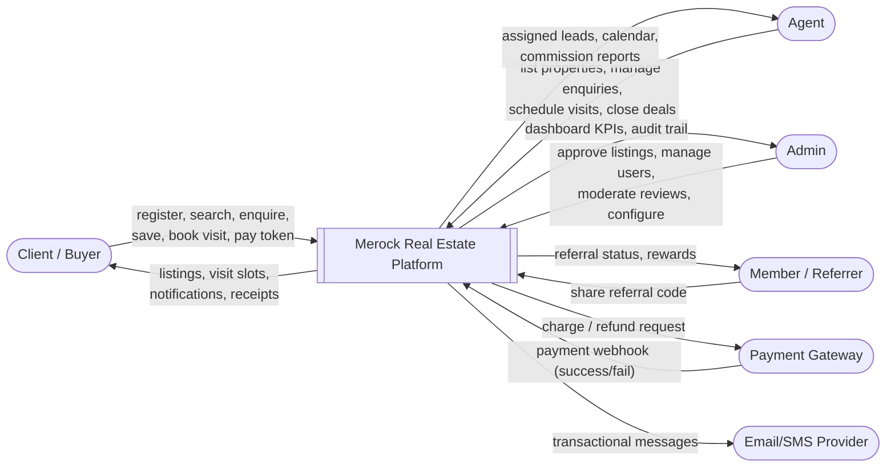
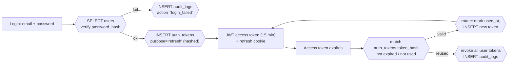
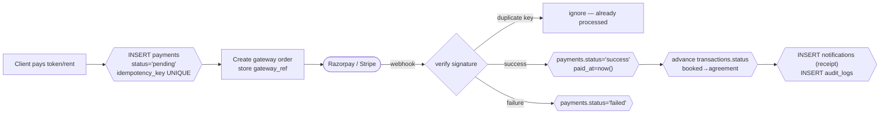

# Merock Real Estate — Data Flow Diagrams

Matches the 18-table schema in `DATABASE_SCHEMA.md`. Browser-viewable version: `data-flow-diagram.html`.

---

## Level 0 — Context Diagram

The system boundary: who talks to Merock and what data crosses it.

---

## Level 1 — System DFD (processes ↔ data stores)

Processes (P1–P7) and the tables (D1–D18) each one reads/writes.

```mermaid
flowchart TB
    subgraph EXT[External Entities]
        CLIENT([Client])
        AGENT([Agent])
        ADMIN([Admin])
        GW([Payment Gateway])
    end

    subgraph P[Processes]
        P1[P1 Authentication<br/>& Registration]
        P2[P2 Property<br/>Management]
        P3[P3 Search &<br/>Discovery]
        P4[P4 Enquiry & Visit<br/>Pipeline CRM]
        P5[P5 Deal & Payment<br/>Processing]
        P6[P6 Referral &<br/>Rewards]
        P7[P7 Notifications<br/>& Audit]
    end

    subgraph DS[Data Stores]
        D1[(D1 users)]
        D2[(D2 auth_tokens)]
        D3[(D3 agent/client_profiles)]
        D4[(D4 properties + images<br/>+ amenities + types)]
        D5[(D5 saved_properties)]
        D6[(D6 enquiries + activities)]
        D7[(D7 property_visits)]
        D8[(D8 transactions)]
        D9[(D9 payments)]
        D10[(D10 referrals)]
        D11[(D11 reviews)]
        D12[(D12 notifications)]
        D13[(D13 audit_logs)]
    end

    CLIENT -->|credentials, signup form| P1
    P1 -->|create/verify user| D1
    P1 -->|issue/rotate tokens| D2
    P1 -->|create profile| D3
    P1 -->|redeem referral code| D10

    AGENT -->|property details, photos| P2
    ADMIN -->|approve / feature| P2
    P2 -->|insert/update listing| D4
    P2 -->|status change record| D13

    CLIENT -->|filters, keywords| P3
    P3 -->|query active listings| D4
    P3 -->|toggle favorite| D5
    P3 -->|listing results| CLIENT

    CLIENT -->|enquiry form| P4
    AGENT -->|notes, status moves, follow-ups| P4
    P4 -->|create enquiry, auto-assign agent| D6
    P4 -->|schedule / outcome| D7
    P4 -->|alert agent & client| P7

    AGENT -->|close deal terms| P5
    GW -->|payment webhook| P5
    P5 -->|create deal, mark converted| D8
    P5 -->|record token/rent/refund| D9
    P5 -->|property → sold/rented| D4
    P5 -->|trigger reward check| P6

    P6 -->|mark converted, set reward| D10
    P6 -->|notify member| P7

    CLIENT -->|review after deal| P4
    P4 -->|store pending review| D11
    ADMIN -->|moderate| D11

    P7 -->|persist in-app message| D12
    P7 -->|write immutable trail| D13
    P7 -->|email/SMS out| EXTMAIL([Email/SMS Provider])
```

---

## Flow 1 — Enquiry → Deal (the core business pipeline)

How data moves through the CRM funnel, with the exact tables touched at each step.

```mermaid
flowchart LR
    A[Client submits<br/>enquiry form] --> B{{"INSERT enquiries<br/>(status='enquired')"}}
    B --> C{{"auto-assign agent_id<br/>(property's agent)"}}
    C --> D{{"INSERT notifications<br/>→ agent"}}
    D --> E[Agent contacts client<br/>INSERT enquiry_activities]
    E --> F[Schedule visit<br/>INSERT property_visits]
    F --> G{{"UPDATE enquiries<br/>status='visited'"}}
    G --> H{Client decision}
    H -- negotiate --> I{{"status='negotiating'<br/>+ activities timeline"}}
    H -- not interested --> J{{"status='closed'<br/>+ closed_reason"}}
    I --> K[Agent records deal<br/>INSERT transactions]
    K --> L{{"UPDATE enquiries<br/>status='converted'"}}
    L --> M{{"UPDATE properties<br/>status='reserved'"}}
    M --> N[Token payment<br/>INSERT payments]
    N --> O{{"webhook: payments.status='success'<br/>transactions.status='agreement'"}}
    O --> P{{"completion:<br/>transactions.status='completed'<br/>properties.status='sold'/'rented'"}}
    P --> Q{{"referral check:<br/>referrals.status='converted'<br/>reward_amount set"}}
    P --> R{{"INSERT notifications<br/>client + agent + admin"}}
    style B fill:#1e3a5f
    style P fill:#14532d
```

---

## Flow 2 — Authentication & Token Lifecycle

---

## Flow 3 — Payment (gateway round-trip, idempotent)

---

## Reading guide

| Symbol | Meaning |
|---|---|
| `([Name])` rounded | External entity (person/system outside the DB boundary) |
| `[Name]` rectangle | Process / user action |
| `{{...}}` hexagon | Database operation (table + mutation) |
| `[(Name)]` cylinder | Data store (table group) |

Key invariants visible in the flows:
- **Every status change** lands in `enquiry_activities` or `audit_logs` — no silent transitions.
- **Money is two-phase**: a `payments` row exists *before* the gateway call; the webhook only flips status (idempotency key makes retries safe).
- **Notifications are side effects**, written after the business mutation commits — never part of the same user-facing transaction path.
